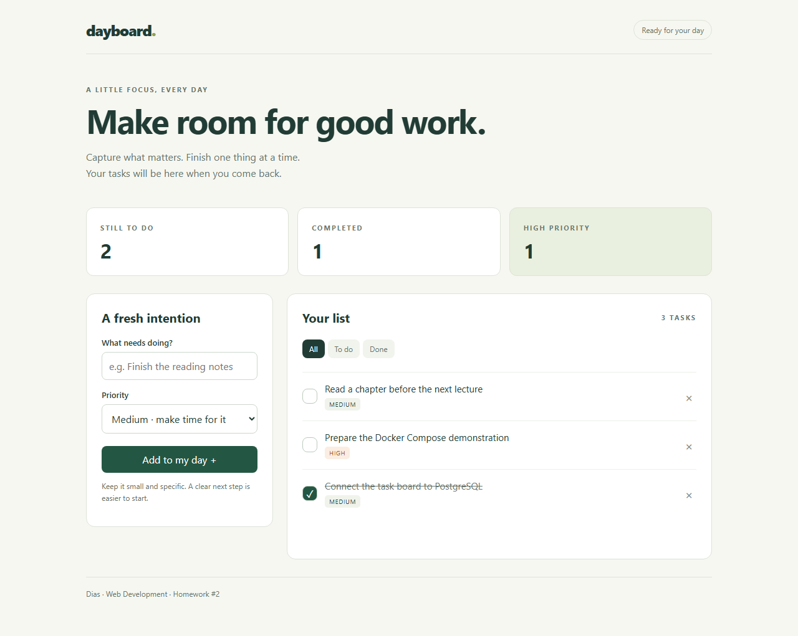

# Homework #2 — Dayboard with Docker Compose

Author: Dias. A task board extending the Python/HTML/JavaScript application from Homework #1. Add tasks, choose priorities, mark tasks done, filter the list, and see live statistics. Tasks are stored in PostgreSQL.

Homework #2 branch: **https://github.com/dikos1705/web_dev/tree/homework-2-docker-compose**. Homework #1 remains in the repository history.



## Start

Requirements: Docker Desktop running in Linux containers mode, Docker Compose v2, and a free port (default 8082).

```sh
git clone --branch homework-2-docker-compose https://github.com/dikos1705/web_dev.git
cd web_dev
```

Place the separately supplied `.env` file in this folder. Alternatively, copy `.env.example` to `.env` and replace its password placeholder with a unique local password.

```powershell
# Windows PowerShell
Copy-Item .env.example .env
```

```sh
# macOS / Linux
cp .env.example .env
```

Start the entire application:

```sh
docker compose up -d --build --wait
```

Open **http://localhost:8082**. If `APP_PORT` differs in your `.env`, use that port. The initial board is empty. Add your own tasks; they survive refresh and container recreation. `docker compose up` also starts everything in foreground. Rebuild after changing source files.

## Architecture

```text
Browser: localhost:8082
       | HTTP
       v
backend:8000 (Flask + Gunicorn, custom Dockerfile)
       | PostgreSQL connection to database:5432
       v
database (PostgreSQL 17) --> postgres-data named volume
```

Both services join `app-network`, a bridge network. `database` is the Compose service name and DNS hostname. Only the backend is published to the host, bound to 127.0.0.1. The database has no host port.

| Requirement | Implementation |
| --- | --- |
| Meaningful backend API | Task create/list/complete/delete and statistics |
| Relational database | PostgreSQL 17, `tasks` table with primary key and constraints |
| Reads AND writes | Parameterized SQL SELECT, INSERT, UPDATE and DELETE via psycopg |
| Custom Dockerfile | Python slim, installed dependencies, non-root user UID 10001, Gunicorn and healthcheck |
| Services and dependencies | `backend`, `database`, and `depends_on: service_healthy` |
| Environment configuration | `.env` supplies database name/user/password, host port and heading |
| Password handling | Required from environment; real `.env` ignored by Git and excluded from image |
| Persistent data | Named `postgres-data` volume at `/var/lib/postgresql/data` |
| One startup command | `docker compose up` |
| Ignore files | `.gitignore` excludes real env files, explicitly allows `.env.example`; `.dockerignore` allows only build inputs |

Backend startup retries database connections and creates the table idempotently. Each request uses a database connection context: successful writes commit and exceptions roll back. Titles use `textContent` in the browser. The backend serves the interface, so there is no third frontend container or CORS setup.

## Configuration

| Variable | Purpose |
| --- | --- |
| `POSTGRES_PASSWORD` | Required local password; template contains a placeholder |
| `POSTGRES_DB` | Database name, default `taskboard` |
| `POSTGRES_USER` | Database user, default `taskboard` |
| `APP_PORT` | Host HTTP port, default `8082` |
| `APP_MESSAGE` | Heading returned by `/api/info` |

Compose passes `DB_HOST=database`, `DB_PORT=5432`, `DB_NAME`, `DB_USER`, and `DB_PASSWORD` to the backend. Backend listens on `PORT=8000`.

Changing `POSTGRES_PASSWORD` after a persistent database has been initialized does not change its existing user's password. Keep the original configuration when reusing its volume.

## API

| Method | Endpoint | Behavior |
| --- | --- | --- |
| GET | `/` | Browser interface |
| GET | `/health` | Real database connectivity check |
| GET | `/api/info` | Runtime heading and internal port |
| GET | `/api/tasks` | Read tasks from PostgreSQL |
| POST | `/api/tasks` | Create task; returns 201; JSON `title` and optional `priority` |
| PATCH | `/api/tasks/{id}` | Set `completed` using a JSON boolean |
| DELETE | `/api/tasks/{id}` | Delete task; returns 204 |
| GET | `/api/stats` | SQL counts: total, completed, remaining, urgent |

Example POST body: `{"title":"Prepare the Compose demo","priority":"high"}`. Example PATCH body: `{"completed":true}`. Priority is `low`, `medium`, or `high`; title length is 1–120 characters after trimming.

Invalid input produces JSON errors, missing tasks return 404, and database failures return 503 without connection details. This local classroom board has no account system; clients share the board.

## Prove persistence

Add a task and mark it completed, then run:

```sh
docker compose down
docker compose up -d --wait
```

Refresh the page: the task and completion flag remain. Containers and network were removed and recreated; the named volume remained. Keep volume-removal options out of the shutdown command when preserving tasks.

## Verification

After startup, use Python 3.10+:

```sh
python verify.py
python verify.py --persistence
```

The persistence mode recreates both containers of this Compose project, verifies a unique test task survives, and removes only its own test records. It leaves the volume and application running. For another host port, use `--base-url http://127.0.0.1:YOUR_PORT`.

Checks cover HTML, database health, real CRUD, SQL statistics, validation, unknown IDs, safe handling of SQL-looking text, ten concurrent writes, non-root backend, exclusion of `.env` from the image, and data persistence. GitHub Actions repeats these checks using an ephemeral random password generated on its runner.

Local Compose/API/persistence checks passed with both containers healthy. The browser check also passed for adding tasks, refresh persistence, completion, filtering, deletion and a 390px mobile viewport.

Optional browser check (requires Playwright separately from the backend):

```sh
python -m pip install playwright
python -m playwright install chromium
python browser_check.py
```

Useful commands:

```sh
docker compose ps
docker compose logs --tail=50
docker compose stop
docker compose start
```

## Submit

1. Submit **https://github.com/dikos1705/web_dev/tree/homework-2-docker-compose**.
2. Attach the separately supplied `.env` file in the homework system. Keep it out of GitHub.
3. Press **Turn In**. See `DEFENSE_RU.md` for the defense walkthrough.

References: [Compose readiness](https://docs.docker.com/compose/how-tos/startup-order/), [Docker volumes](https://docs.docker.com/engine/storage/volumes/), [psycopg queries and transactions](https://www.psycopg.org/psycopg3/docs/basic/usage.html).
